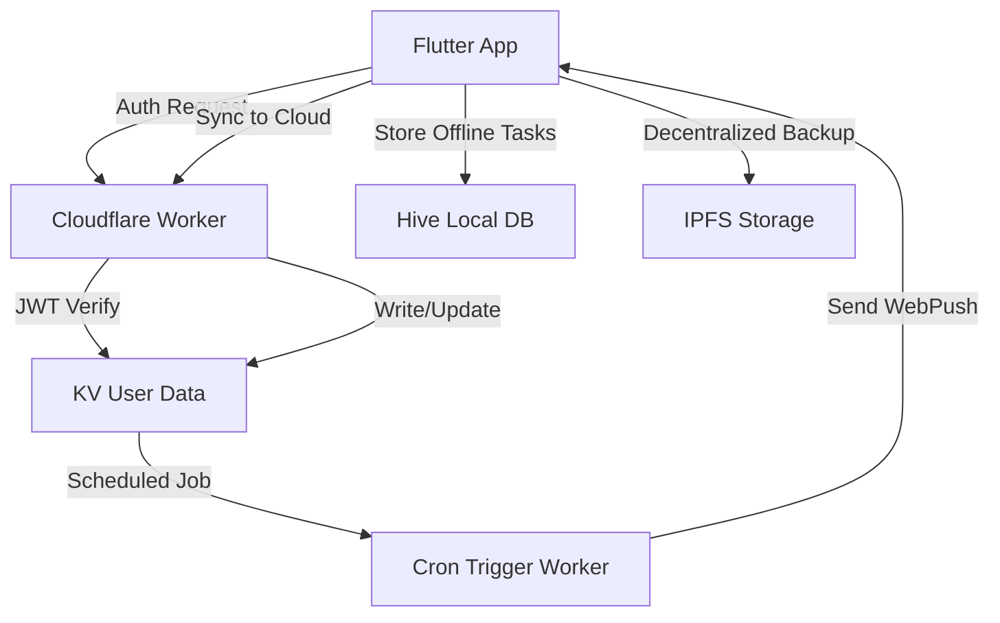

# 🎯 Streaky - Zero-Cost Social Productivity & Automation App

> **A complete, production-ready Flutter mobile app with serverless Cloudflare Workers backend, designed to scale to 10M users with ₹0 infrastructure cost.**

[](https://flutter.dev/)
[](https://workers.cloudflare.com/)
[](LICENSE)
[](.github/workflows/deploy.yml)

---

## ⚙️ PROJECT OBJECTIVE

Create a **production-grade mobile app** that helps users:

- Manage and automate daily tasks
- Maintain productivity streaks
- Collaborate socially via P2P sync
- Access AI-based task recommendations
- Scale globally with **₹0 infrastructure cost**

---

## 🧩 TECH STACK OVERVIEW

| Layer         | Component             | Technology                      |
| ------------- | --------------------- | ------------------------------- |
| Frontend      | Cross-platform App    | **Flutter 3.x**                 |
| Offline DB    | Local cache           | **Hive / Drift**                |
| Realtime Sync | Cloud + P2P           | **Firestore + WebRTC + CRDT**   |
| Backend       | Serverless            | **Cloudflare Workers + KV**     |
| Storage       | Structured & Media    | **Supabase + IPFS**             |
| ML Engine     | Smart task prediction | **TensorFlow Lite (on-device)** |
| Notifications | Local & cloud         | **Flutter Local Notifications** |
| Monetization  | Freemium + Ads        | **Google Play Billing + AdMob** |
| Analytics     | Privacy-first         | **PostHog (self-hosted)**       |

---

## 🧱 PROJECT STRUCTURE

```
project_root/
├── lib/
│   ├── main.dart
│   ├── models/
│   │   ├── task_model.dart
│   │   ├── user_model.dart
│   │   └── streak_model.dart
│   ├── screens/
│   │   ├── home_screen.dart
│   │   ├── auth_screen.dart
│   │   ├── streak_screen.dart
│   │   └── analytics_screen.dart
│   ├── services/
│   │   ├── kv_service.dart        # Cloudflare Worker API Calls
│   │   ├── jwt_service.dart       # Token encode/decode
│   │   ├── local_storage.dart     # Hive local storage
│   │   ├── notification_service.dart
│   │   └── sync_service.dart
│   ├── providers/
│   │   ├── streak_provider.dart
│   │   ├── task_provider.dart
│   │   └── auth_provider.dart
│   ├── ai/
│   │   ├── schedule_model.tflite
│   │   └── ai_inference.dart
│   ├── utils/
│   │   ├── constants.dart
│   │   └── theme.dart
│   └── widgets/
│       ├── task_card.dart
│       ├── streak_badge.dart
│       └── custom_button.dart
├── worker/
│   ├── index.js                   # Main Worker entry (JWT + KV)
│   ├── auth_validator.js
│   ├── analytics_logger.js
│   ├── kv_schema.json             # KV namespaces & structure
│   └── wrangler.toml              # Cloudflare config
├── assets/
│   ├── icons/
│   └── images/
├── android/
├── ios/
├── web/
├── .github/
│   └── workflows/
│       └── ci-cd.yml
├── pubspec.yaml
└── analysis_options.yaml
```

---

## 🧠 DEVELOPMENT PHASES

### **Phase 1: Foundation Setup** ✅

- Initialize Flutter project with Hive integration
- Implement navigation (Home, Tasks, Profile)
- Setup local storage for offline tasks
- Add local reminders (flutter_local_notifications)

**KPIs:**  
✅ App loads < 2s  
✅ Task CRUD working offline

---

### **Phase 2: Edge API Integration** 🚧

- Add JWT authentication service
- Implement WebRTC peer-to-peer sync for group streaks
- Use CRDT (`automerge` or `y-crdt`) to resolve sync conflicts
- Create leaderboards (Cloudflare KV + Edge Workers)

**Example logic:**

```dart
void mergeStreaks(Streak local, Streak remote) {
  if (remote.lastUpdate.isAfter(local.lastUpdate)) {
    local = remote;
  }
  saveLocally(local);
}
```

**KPIs:**
✅ P2P streak sync success rate ≥95%
✅ Conflict-free merges

---

### **Phase 3: AI Automation Engine** 📋

- Collect anonymized usage pattern (locally stored)
- Train ML model for "Best time to complete tasks"
- Convert to TensorFlow Lite and integrate locally
- Add AI button → "Suggest task time & type"

**Code example:**

```dart
final interpreter = await Interpreter.fromAsset('schedule_model.tflite');
var input = [userVector];
var output = List.filled(1, 0).reshape([1, 1]);
interpreter.run(input, output);
```

**KPIs:**
✅ Model inference < 200ms
✅ Accuracy ≥70%

---

### **Phase 4: Freemium & Monetization** 💰

- Implement two tiers: Free & Premium
- Premium unlocks AI scheduling, analytics, and group streaks
- Add Google Play Billing
- Validate token locally using JWT decode
- Add AdMob for Free users

**Flow:**

```
[Free User] → [AI Suggest Popup] → [Upgrade CTA] → [Purchase] → [Unlock Premium Features]
```

---

## 🔐 SECURITY MODEL

| Layer          | Protection                    |
| -------------- | ----------------------------- |
| Auth           | Firebase JWT + device binding |
| Storage        | AES-256 encryption (Hive)     |
| Network        | HTTPS + DTLS (WebRTC)         |
| AI Data        | Processed locally only        |
| Premium Tokens | Local JWT validation          |

---

## 💰 MONETIZATION FLOW

```
Free → AI Suggests Upgrade → Purchase → Token Validated → Premium Features Unlocked
```

Revenue Streams:

1. In-app subscriptions
2. AdMob ads
3. Sponsored challenges
4. Team subscriptions (future)

---

## 🧰 BACKEND DESIGN

| Function          | Tool              | Purpose               |
| ----------------- | ----------------- | --------------------- |
| Auth Validation   | Cloudflare Worker | Verify JWT            |
| Analytics Logging | KV / PostHog      | Usage tracking        |
| Storage           | Cloudflare KV     | Sync streaks & groups |
| CDN / Media       | IPFS              | Cost-free hosting     |
| Edge Caching      | Cloudflare Pages  | Fast static delivery  |

---

## 🚀 CI/CD PIPELINE

| Stage       | Tool             | Action                  |
| ----------- | ---------------- | ----------------------- |
| Code Commit | GitHub           | Trigger Actions         |
| Build       | GitHub Actions   | Flutter build (APK/Web) |
| Deploy      | Cloudflare       | Zero downtime release   |
| Monitor     | PostHog / Sentry | Crash + usage logs      |

---

## 🪙 ZERO-COST STRATEGY SUMMARY

| Service            | Free Limit        | Usage         |
| ------------------ | ----------------- | ------------- |
| Cloudflare Workers | 100K requests/day | API + Auth    |
| Cloudflare KV      | 1GB               | Edge cache    |
| Flutter Web        | Static hosting    | PWA version   |
| IPFS               | Unlimited         | Media storage |
| PostHog            | Self-hosted       | Analytics     |
| AdMob              | Free revenue      | Monetization  |

---

## 📈 TARGET METRICS

| Metric              | Target      |
| ------------------- | ----------- |
| Launch Time         | <2 sec      |
| Sync Delay          | <1.5 sec    |
| AI Accuracy         | ≥70%        |
| Offline Reliability | ≥98%        |
| Infra Cost          | ₹0          |
| Retention           | ≥60% 30-day |

---

## 🧩 QUICK START

### Prerequisites

- Flutter 3.x
- Node.js 18+
- Cloudflare CLI (`wrangler`)

### Installation

```bash
# Clone repository
git clone https://github.com/yourusername/streaky_app.git
cd streaky_app

# Install Flutter dependencies
flutter pub get

# Generate Hive adapters
dart run build_runner build

# Setup Cloudflare Worker
cd worker
npm install
wrangler login

# Create KV namespace
wrangler kv:namespace create "USER_KV"

# Deploy worker
wrangler deploy

# Run Flutter app
cd ..
flutter run
```

### Environment Setup

Create `.env` file:

```env
CLOUDFLARE_WORKER_URL=https://your-worker.your-subdomain.workers.dev
JWT_SECRET=your-256-bit-secret
ANALYTICS_KEY=your-posthog-key
```

---

## 🧾 API ENDPOINTS

| Endpoint   | Method | Description           |
| ---------- | ------ | --------------------- |
| `/auth`    | POST   | Generate/validate JWT |
| `/tasks`   | GET    | Fetch user tasks      |
| `/tasks`   | POST   | Create/update tasks   |
| `/streaks` | GET    | Get streak data       |
| `/sync`    | POST   | Sync offline changes  |

---

## 🔄 DATA FLOW



---

## 📱 FEATURES

### Core Features

- ✅ Offline-first task management
- ✅ Daily/weekly streak tracking
- ✅ Local notifications & reminders
- ✅ Real-time sync across devices
- ✅ Social streak sharing

### AI Features (Phase 3)

- 🚧 Smart task scheduling
- 🚧 Productivity pattern analysis
- 🚧 Automated routine suggestions
- 🚧 Natural language task creation

### Premium Features

- 💎 Advanced analytics
- 💎 Team collaboration
- 💎 Custom automations
- 💎 Priority support

---

## 🤝 CONTRIBUTING

1. Fork the repository
2. Create feature branch (`git checkout -b feature/amazing-feature`)
3. Commit changes (`git commit -m 'Add amazing feature'`)
4. Push to branch (`git push origin feature/amazing-feature`)
5. Open Pull Request

---

## 📄 LICENSE

This project is licensed under the MIT License - see the [LICENSE](LICENSE) file for details.

---

## 👨‍💻 AUTHOR

**Gokul Kumar**

- GitHub: [@gokul](https://github.com/gokul)
- Email: gokul@example.com

---

## 🚀 PROJECT VISION

> "Build the world's most scalable productivity platform — for free."

**Goal:** A zero-cost, AI-powered, socially connected productivity app built for millions — with privacy, efficiency, and automation at its core.

---

## 📊 ROADMAP

- [x] Phase 1: MVP Foundation (Months 1-2)
- [ ] Phase 2: Edge Integration (Months 3-4)
- [ ] Phase 3: AI Automation (Months 5-6)
- [ ] Phase 4: Social Features (Months 7-8)
- [ ] Phase 5: Monetization (Months 9+)

---

## 📞 SUPPORT

For support and questions:

- 📧 Email: support@streakyapp.com
- 💬 Discord: [Join our community](https://discord.gg/streakyapp)
- 🐛 Issues: [GitHub Issues](https://github.com/yourusername/streaky_app/issues)
